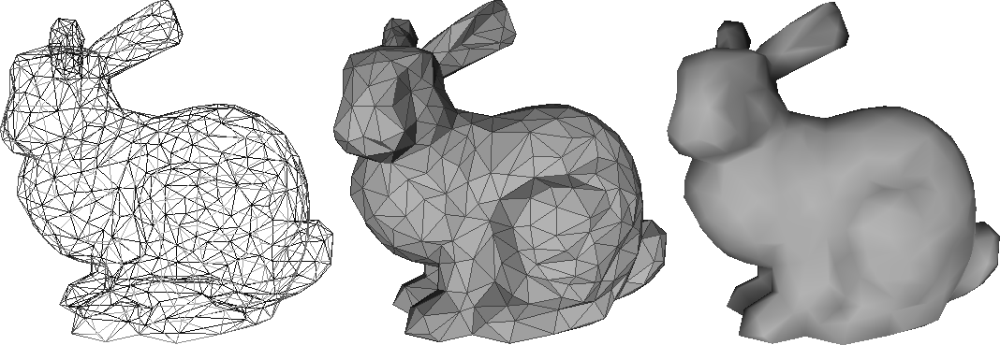

Rasterization Basics
===============

In this exercise, you will implement a rendering system for triangulated 3D models based on rasterization.

### Using Eigen

In all exercises, you will need to do operations with vectors and matrices. To simplify the code, you will use [Eigen](http://eigen.tuxfamily.org/).
Have a look at the [Getting Started](http://eigen.tuxfamily.org/dox/GettingStarted.html) page of Eigen as well as the [Quick Reference](http://eigen.tuxfamily.org/dox/group__QuickRefPage.html}) page for a reference of the basic matrix operations supported.

### Preparing the Environment and Submission

Follow the instructions on the [general instructions page](../RULES.md) to set up what you need for the assignment.

**Note**: For the purpose of exercises 1 to 2, the world space, camera space, and canonical viewing volume will be one and the same. 

Ex.1: Load and Render a 3D model
------------------

The provided code rasterizes a triangle using the software rasterizer we studied in the class. Extend the provided code to load the same scenes used in Assignment 4, and render them using rasterization in a uniform color. At this stage, you should see a correct silhouette of the object rendered.

Ex.2: Shading
-------------

In this exercise, you will implement different shading options for the triangles. The scene should always contain at least one light source, set as a shader uniform. Add an option to the code to render three different versions of the model:

1. **Wireframe**: only the edges of the triangles are drawn.

2. **Flat Shading**: each triangle is rendered using a unique color (i.e. the normal of all the fragments that compose a triangle is simply the normal of the plane that contains it). On top of the flat shaded triangle, you should draw the wireframe.

3. **Per-Vertex Shading**: the normals are specified on the vertices of the mesh, the color is computed for each vertex, and then interpolated in the interior of the triangle.

Both flat shading and per-vertex shading should use the same code in the shader program. The only difference lies in the attributes that are sent to the vertex shader. You can reuse the code from the ray-tracing assignment for the lighting equation (you should implement both *diffuse* and *specular* shading components in the fragment shader).

Note that to perform flat shading, you will need to send per-face normal attributes to the shader program. However, with the provided rasterizer and for most modern APIs, it is only possible to send *per-vertex* attributes. One simple way to go around this limitation is simply to duplicate the input vertices for every triangle in the mesh. That is, from a pair **(V, F)** describing the mesh coordinates and triangles, build a new pair **(V', F')**, where every vertex from **V'** appears only once in **F'**.

To compute the per-vertex normals you should first compute the per-face normals, and then average them on the neighboring vertices. In other words, the normal of the vertex of a mesh should be the average of the normals of the faces touching it. Remember to normalize the normals after averaging.

Ex.3: Object Transformation
--------------------

For this exercise and the next, all transformations **must** be done in the vertex shader. 

Add an option to tranlate the object toward the camera, while rotating around its barycenter. Produce 3 gif videos, one for each rendering type used above.

Ex.4: Camera
-------------------------------

Implement a *perspective camera* and add support for multiple resolutions: the cameras should take into account the size of the framebuffer, properly adapting the aspect ratio to not distort the image whenever the framebuffer is resized. To check for correctness, we recommend to render a cube in wireframe mode.

Note that for the shading to be correct, the lighting equation need to be computed in the camera space (sometimes called the *eye space*). This is because in the camera space the position of the camera center is known (it is (0,0,0)), but in the canonical viewing volume normals can be distorted by the perspective projection, so shading will be computed incorrectly.
